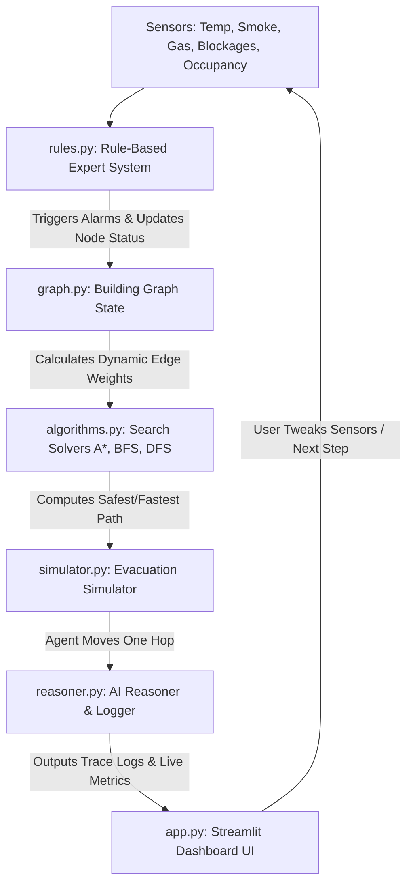

# 🚨 Hybrid Incident Response Agent: System Documentation & Architecture Guide

This document provides a comprehensive, in-depth explanation of the **Hybrid Incident Response Agent** emergency evacuation system. It details the architectural design, core codebase modules, algorithmic details, safety rule-base logic, interactive user interface elements, and trade-off analysis.

---

## 🎯 1. Overview & System Goal

The **Hybrid Incident Response Agent** is an intelligent, AI-based emergency evacuation routing and simulation system. It is designed to navigate an agent through a multi-floor building from any given room to the safest, closest exit. 

Unlike traditional static routing systems, this platform implements a **hybrid architecture** combining:
1. **Rule-Based Expert Systems**: Evaluating sensor inputs (temperature, smoke, gas levels, occupancy, exit blockages) to dynamically adjust safety hazards, block paths, and trigger emergency alarms.
2. **Dynamic Search Algorithms**: Graph-search solvers (A*, BFS, DFS implemented from scratch) that recalculate routing paths in real-time based on the updated state of the building.

The system is deployed as an interactive dashboard built using **Streamlit** (UI), **NetworkX** (graph modeling), and **Matplotlib** (visualization).

---

## 🏗️ 2. System Architecture & Core Concepts

The system operates as a loop where sensor data continuously alters the graph representation of the building, and the search algorithms find the optimal path in real-time.

### A. Graph Representation (`agent/graph.py`)
The building layout is modeled as a bidirectional graph with 20 nodes representing rooms, corridors, and exits across 2 floors:
- **Floor 1 Rooms**: `R1` to `R5`
- **Floor 1 Corridors**: `C1`, `C2`
- **Floor 2 Rooms**: `R6` to `R10`
- **Floor 2 Corridors**: `C3`, `C4`
- **Connecting Stairwell (Floor 1 ↔ Floor 2)**: `C5` (acts as the connector between floors)
- **Exits**: `EXIT-A` & `EXIT-B` (Floor 1), `EXIT-C` & `EXIT-D` (Floor 2)

### B. Dynamic Cost Weights
Every edge traverse from node $u$ to neighbor $v$ has a dynamic cost calculated by:

$$\text{Cost}(u, v) = \text{Euclidean\_Distance}(u, v) + \text{Hazard\_Score}(v) \times 3.0 + \text{Crowd\_Density}(v) \times 2.0$$

- **Distance**: Encourages the agent to take short physical paths.
- **Hazard Score ($[0.0, 1.0]$)**: High penalty representing fires, gas leaks, or extreme temperature/smoke.
- **Crowd Density ($[0.0, 1.0]$)**: Penalty modeling foot traffic congestion (crowd surge) causing delays.

### C. Search Algorithms (`agent/algorithms.py`)
The routing solvers are implemented from scratch without external dependencies:
1. **A* Search**: Uses an admissible heuristic—the minimum Euclidean distance from the current node to any active exit node. Finds the path minimizing total dynamic cost.
2. **Breadth-First Search (BFS)**: Traverses nodes level-by-level. It is optimal *only* in terms of hop count (minimizing intermediate nodes), completely ignoring hazard and crowd costs.
3. **Depth-First Search (DFS)**: Explores deep branches recursively. It is non-optimal, highly volatile, and may direct the agent straight through a fire if that is the first path it discovers.

---

## 📂 3. Code Modules Deep Dive

### 🗺️ `agent/graph.py`
This module manages the building geometry and topology.
* **`NODE_COORDS`**: Maps each node (e.g., `R1`, `C1`, `EXIT-A`) to its precise $(x, y)$ coordinate.
* **`DEFAULT_EDGES`**: List of connected nodes (bidirectional).
* **`BuildingGraph` Class**:
  * `reset_graph()`: Reinitializes all nodes and edges to default values (zero hazards, open exits).
  * `block_node(node)`: Excludes a node from search traversal (agent cannot pass).
  * `update_hazard(node, score)`: Sets hazard level ($0.0$ to $1.0$).
  * `update_crowd_density(node, density)`: Sets crowd occupancy penalty ($0.0$ to $1.0$).
  * `get_edge_weight(u, v)`: Returns the weighted composite cost of traversal.

### 🧠 `agent/rules.py`
This module represents the **Expert System Rule-Base**. It takes real-time sensor readings and modifies the graph:
1. **Fire Safety Rule**: If `temperature > 60°C` or `smoke > 0.7`:
   * Set incident type = `FIRE`, severity = `RED`.
   * Block nearest exit (`EXIT-B`).
   * Elevate hazards of surrounding nodes (`R5` = $0.9$, `C2` = $0.6$).
2. **Gas Leak Rule**: If `gas_ppm > 300`:
   * Set incident type = `GAS_LEAK`, severity = `ORANGE`.
   * Block ventilation corridors (`C1` and `C3`) to contain the gas propagation.
3. **Blocked Exit Rule**: If manual blockage sensor for an exit is triggered (`exit_status == 0`):
   * Set incident type = `BLOCKED_EXIT`, severity = `ORANGE`.
   * Block the exit node.
4. **Crowd Surge Rule**: If a corridor's occupancy is `> 80%`:
   * Set incident type = `CROWD_SURGE`, severity = `YELLOW`.
   * Set crowd density = $1.0$ for that corridor to trigger dynamic detour rerouting.

### 🏃 `agent/simulator.py`
Coordinates the evacuation simulation.
* **State Management**: Tracks agent position (starts at user-specified room), step index, path history, and if the agent has reached safety (`finished = True`).
* **`run_step()` Logic**:
  1. Resets graph state.
  2. Evaluates sensor rules (updates graph parameters/blocks nodes).
  3. Executes **A***, **BFS**, and **DFS** simultaneously for the current step to gather performance comparison data.
  4. Selects the next hop according to the user-selected active algorithm.
  5. Updates agent position and compiles trace logs.

### 📋 `agent/reasoner.py`
Constructs the AI decision rationale explaining *why* the path was selected.
* **`generate_step_trace()`**: Generates a detailed ASCII trace log output containing:
  * Current agent position, active incidents, and blocked/unreachable nodes.
  * Search progress details ($u \to v$ next hop weights, distance, hazards, and total path cost).
  * Algorithmic comparison: lists alternative paths found by other algorithms and their costs.

### 🖥️ `app.py`
The frontend dashboard rendering controls, visualization, and metrics.
* **Sidebar Controls**:
  * Dropdown to select the active algorithm (`A*`, `BFS`, `DFS`).
  * Dropdown to choose starting room (`R1`-`R10`).
  * Incident Preset Select (Normal, Fire in East Wing, Gas Leak in West Wing, Blocked Corridors, Crowd Surge) which pre-populates sliders.
  * Real-time sliders to customize Temperature, Smoke, Gas (PPM), blocked exits, and corridor occupancies.
  * Action buttons: `Start / Reset` and `Next Step`.
* **Dashboard Layout (3-Column Layout)**:
  * **Column 1 (Map)**: Uses networkx & matplotlib to plot nodes and connections. Highlights nodes dynamically (Blue = Agent, Green = Exit, Red = Blocked, Yellow = Hazard). Highlighting active path with green edges.
  * **Column 2 (Trace)**: Displays the reasoning log with color-coded backdrops corresponding to severity levels (Red, Orange, Yellow, Green).
  * **Column 3 (Metrics)**: Displays live stats (explored nodes, execution time, total path cost) and a live comparison table comparing all three algorithms side-by-side.
* **Bottom Section**: Algorithmic trade-off table summarizing complexities and evacuation suitability.

---

## ⚖️ 4. Algorithmic Trade-off Analysis

| Feature / Metric | A* Search (Dynamic Cost) | Breadth-First Search (BFS) | Depth-First Search (DFS) |
| :--- | :--- | :--- | :--- |
| **Optimality** | **Guaranteed Optimal** (for safety + distance) | Optimal for **Hop Count** only | **Non-optimal** (returns first path) |
| **Time Complexity** | $O(E \log V)$ | $O(V + E)$ | $O(V + E)$ |
| **Space Complexity**| $O(V)$ | $O(V)$ | $O(V)$ |
| **Safety Evasion** | **High** (avoids blocked & high-threat nodes) | **Low** (may run agent through fire) | **Very Low** (highly volatile routing) |
| **Ideal Scenario** | Standard evacuation with hazard zones | Uniform safety across all corridors | Simple connectivity checks |

---

## 🏃 5. Step-by-Step Execution Walkthrough

Here is an example of what happens when a **Fire in East Wing** incident is triggered:

1. **Rule Evaluation**:
   * Temperature slider is at $72^\circ\text{C}$ and smoke is $0.88$.
   * `rules.py` triggers `FIRE` incident. Severity is classified as `RED`.
   * `EXIT-B` is marked blocked.
   * Corridor `C2` hazard is set to $0.6$ and Room `R5` is set to $0.9$.
2. **Graph Modifications**:
   * The graph removes connections to `EXIT-B`.
   * Edges connecting to `C2` and `R5` receive massive penalty weight increases.
3. **Pathfinding**:
   * **BFS** counts steps: it tries to go to the nearest exit by hop count (might direct the agent towards `C2` / `R5` if it saves one hop).
   * **A*** sees the massive penalty weights on `C2` and `R5`. It routes the agent away from the East Wing, directing it through stairwell `C5` to Floor 2 to exit safely via `EXIT-C` or `EXIT-D`.
4. **Agent Action**:
   * The agent moves one step along the A* path.
   * Reasoner creates a trace log detailing: `"Next hop C5: hazard=LOW(0.0), crowd=LOW(0.0), step_cost=3.61 (Total Path Cost: 9.8)"` and compares it to BFS/DFS outcomes.
